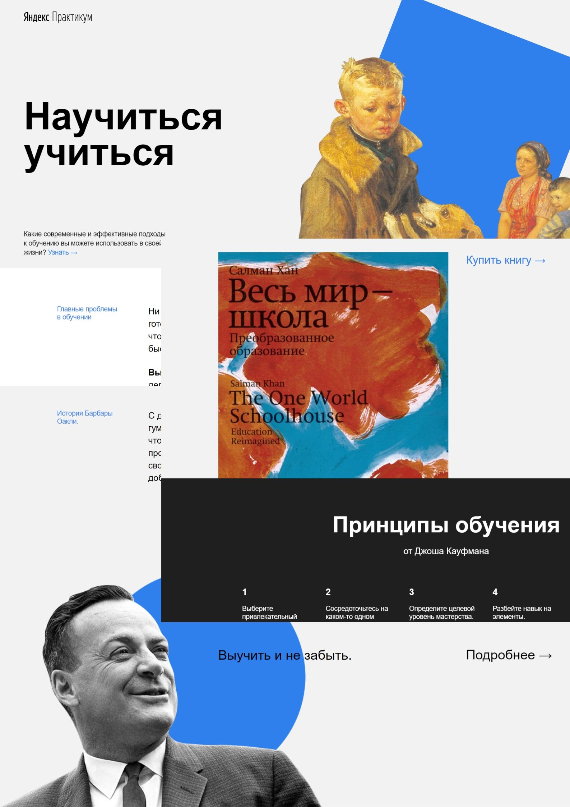

# **Первая учебная работа HTML/CSS на Яндекс.Практикум**
---
### Моя первая вёрстка - одностраничный сайт https://belovroman90.github.io/how-to-learn/
---

При создании, основными инструментами были:

* флексбокс-вёрстка;
* позиционирование;
* семантика HTML;
* методология БЭМ;
* работа с анимациями и фреймами.
---
В ближайшем будущем будут изменены шрифты и видео, код станет кроссбраузерный,
а также появится форма для комментариев *посетителей* сайта, которых никогда не будет.
